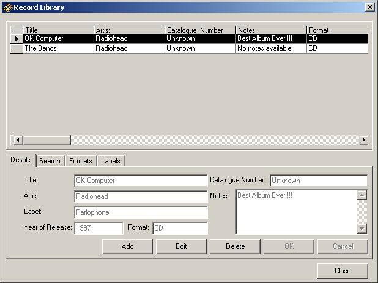



## Record Library

### Description

I wrote this app because I was looking for a simple way to store my Records and CD's in a database, so here it is. Hope you like it! Any comments are welcome off course.

NOTE: Before you start using it, make sure you have the ODBC settings right, so do either one of these two things:

first,you can make a manual ODBC connection (SYSTEM DSN, Microsoft Access driver, etc, and in Select Database --> Browse to the database then select it.)

Second, in modDeclarations, replace this line of code

"Public Const DB_RecordLibraryConnectionString As String = "DSN=RecordLibrary;UID=;PWD=""

with this one:

Public Const DB_RecordLibraryConnectionString As String = "Provider=Microsoft.Jet.OLEDB.4.0;Data Source=PATH TO YOUR DATABASE\RecordLibrary.mdb;Persist Security Info=False"

Now it should work fine!

Enjoy the Record Library and feel free to drop me a line!
 
### More Info
 

             |
---                |---
**Submitted On**   |2001-09-26 15:45:30
**By**             |[Pascal Louwes](https://github.com/Planet-Source-Code/PSCIndex/blob/master/ByAuthor/pascal-louwes.md)
**Level**          |Intermediate
**User Rating**    |5.0 (15 globes from 3 users)
**Compatibility**  |VB 6\.0
**Category**       |[Complete Applications](https://github.com/Planet-Source-Code/PSCIndex/blob/master/ByCategory/complete-applications__1-27.md)
**World**          |[Visual Basic](https://github.com/Planet-Source-Code/PSCIndex/blob/master/ByWorld/visual-basic.md)
**Archive File**   |[Record Lib269999262001\.zip](https://github.com/Planet-Source-Code/pascal-louwes-record-library__1-27557/archive/master.zip)

